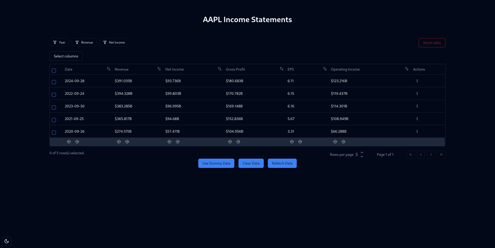

# Financial Filtering

A financial data filtering app using data from a single API endpoint. The app fetches
annual income statements for AAPL (Apple) and allow users to filter and analyze key metrics

## Features
- Filtering by Year, Revenue, and Net Income (Minimal error handling via toast alerts)
- Sorting each column by ascending/descending
- Dark/Light Mode Toggle via button in bottom left
- Moveable columns
- Ability to hide columns
- Access to full JSON per Income Statement via Actions column drop down menu
- Customizable rows per page
- Pagination (Option to use dummy data to show multiple rows as API is limited to 5 responses)


## Live Demo
Project is deployed and live on Render!


## Getting started
NOTE: This is assuming you have Node>=16.19.1 installed

1. To run the Vite React App in development install pnpm if not already installed

      ```
      curl -fsSL https://get.pnpm.io/install.sh | sh -
      ```
      or
      ```
      npm install -g pnpm
      ```
2. Install and run the dev server (Don't forget to run these commands in the working directory!)
      ```
      pnpm install
      ```
      ```
      pnpm run dev
      ```
3. (Optional) To run the linter to find any eslint violations run
      ```
      pnpm run lint
      ```

4. (Optional) To run the formatter to reformat all files using Prettier
      ```
      pnpm run prettier
      ```

5. Create .env file using .env.example
      - I will be removing this .env.example later as this is not good practice to expose API keys
